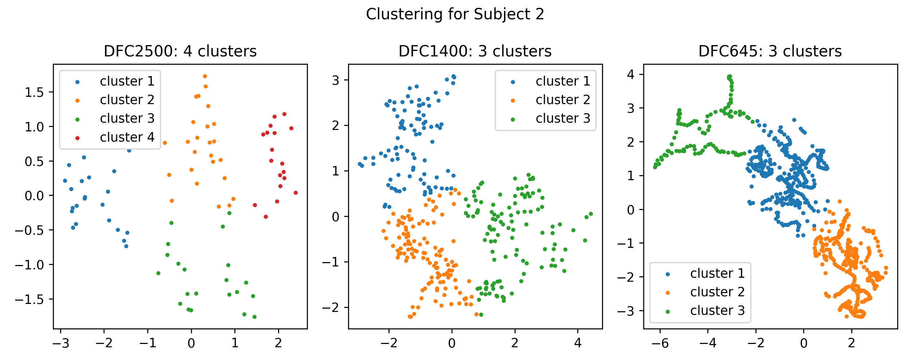
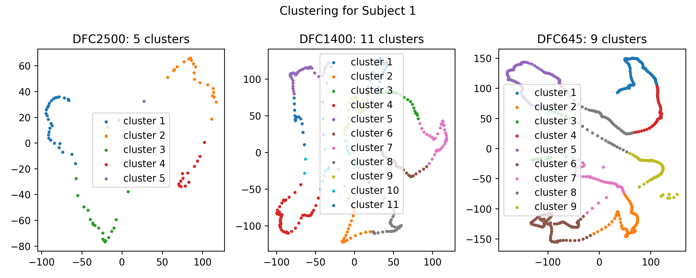
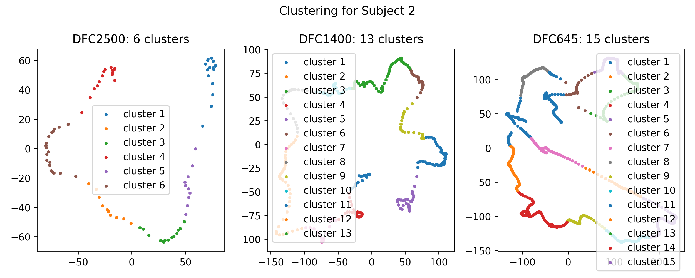
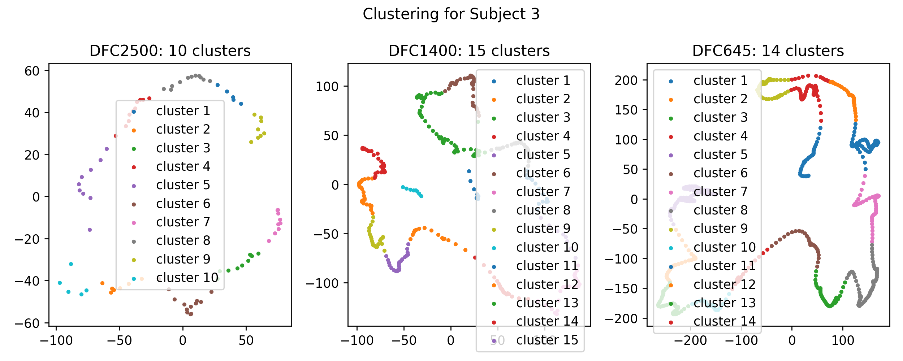

### Set up environment
- Create, activate, and install required packages using Python 3:
```shell
python3 -m venv venv
source venv/bin/activate
pip install -r requirements.txt
```

### Dataset
- Data dimensions:
  - DFC 2500: 316 x 86 x 113 x 113,
  - DFC 1400: 316 x 336 x 113 x 113
  - DFC 645: 316 x 754 x 113 x 113 
- Normalize data should be in three folders:
```shell
../dfc_645_normal
../dfc_1400_normal
../dfc_2500_normal
```
- Sample name for normalize data: `normalize_dfc_2500_subject_1_time_1.txt`
- Generated distance matrix folders for TDA pipeline:
```shell
../dfc_645_subjects_distance_matrix_ws
../dfc_1400_subjects_distance_matrix_ws
../dfc_2500_subjects_distance_matrix_ws
```
- Generated distance matrix folders for nonTDA pipeline:
```shell
../dfc_645_non_tda_subjects_distance_matrix_eu
../dfc_1400_non_tda_subjects_distance_matrix_eu
../dfc_2500_non_tda_subjects_distance_matrix_eu
```
- Generated mds folders:
```shell
../dfc_645_subjects_mds
../dfc_1400_subjects_mds
../dfc_2500_subjects_mds
```
- Generated cluster folders:
```shell
../clusters_kmeans
../clusters_kmeans_non_tda
```
### Run the programs
```
python -u distance_calculation.py --data 645 --method ws --start 1 --end 316 --distance y --mds y
python -u distance_calculation.py --data 1400 --method ws --start 1 --end 316 --distance y --mds y
python -u distance_calculation.py --data 2500 --method ws --start 1 --end 316 --distance y --mds y
python -u cluster_calculation.py
```

### Results
- Clustering with Wasserstein distance:
``` 
Clustering Method: KMeans
Best cluster selection using Silhouette Score in 2-15 range
Total subjects: 316
Match percentages:
Distance:   0, number of subjects: 118, percentage: 37.34%
Distance:   1, number of subjects:  70, percentage: 22.15%
Distance:   2, number of subjects:  18, percentage: 5.70%
Distance:   3, number of subjects:  17, percentage: 5.38%
Distance:   4, number of subjects:  22, percentage: 6.96%
Distance:   5, number of subjects:  13, percentage: 4.11%
Distance:   6, number of subjects:   8, percentage: 2.53%
Distance:   7, number of subjects:  11, percentage: 3.48%
Distance:   8, number of subjects:   8, percentage: 2.53%
Distance:   9, number of subjects:   8, percentage: 2.53%
Distance:  10, number of subjects:   6, percentage: 1.90%
Distance:  11, number of subjects:   5, percentage: 1.58%
Distance:  12, number of subjects:   6, percentage: 1.90%
Distance:  13, number of subjects:   6, percentage: 1.90%
```
- Clustering with Bottleneck distance:
```
Done. Generated clusters: subject 1 - 316

Clustering Method: KMeans
Best cluster selection using Silhouette Score in 2-15 range
Total subjects: 316
Match percentages:
Distance:   0, number of subjects:   5, percentage: 1.58%
Distance:   1, number of subjects:  33, percentage: 10.44%
Distance:   2, number of subjects:  36, percentage: 11.39%
Distance:   3, number of subjects:  28, percentage: 8.86%
Distance:   4, number of subjects:  21, percentage: 6.65%
Distance:   5, number of subjects:  29, percentage: 9.18%
Distance:   6, number of subjects:  26, percentage: 8.23%
Distance:   7, number of subjects:  25, percentage: 7.91%
Distance:   8, number of subjects:  18, percentage: 5.70%
Distance:   9, number of subjects:  21, percentage: 6.65%
Distance:  10, number of subjects:  20, percentage: 6.33%
Distance:  11, number of subjects:  22, percentage: 6.96%
Distance:  12, number of subjects:  16, percentage: 5.06%
Distance:  13, number of subjects:  16, percentage: 5.06%
```
- Clustering non TDA distance (Euclidean distance):
```
Clustering Method: KMeans
Best cluster selection using Silhouette Score in 2-15 range
Total subjects: 316
Match percentages:
Distance:   0, number of subjects:   1, percentage: 0.32%
Distance:   1, number of subjects:   4, percentage: 1.27%
Distance:   2, number of subjects:   9, percentage: 2.85%
Distance:   3, number of subjects:  15, percentage: 4.75%
Distance:   4, number of subjects:  23, percentage: 7.28%
Distance:   5, number of subjects:  35, percentage: 11.08%
Distance:   6, number of subjects:  31, percentage: 9.81%
Distance:   7, number of subjects:  28, percentage: 8.86%
Distance:   8, number of subjects:  34, percentage: 10.76%
Distance:   9, number of subjects:  32, percentage: 10.13%
Distance:  10, number of subjects:  33, percentage: 10.44%
Distance:  11, number of subjects:  32, percentage: 10.13%
Distance:  12, number of subjects:  29, percentage: 9.18%
Distance:  13, number of subjects:  10, percentage: 3.16%
```
- Distance with Bottleneck distance output for DFC 2500:
```
bn distance JSON created for Subject 316
Done generating the {distance_method} distance matrix JSON files
Method generate_distance_matrix(('../dfc_2500_normal', '../dfc_2500_subjects_distance_matrix_bn', 316, 86, 'normalize_dfc_2500_subject_', 1, 316), {'distance_method': 'bn'}) executed in 3660.6987 seconds


MDS JSON created for Subject 315
Method get_mds_matrix((316, '../dfc_2500_subjects_distance_matrix_bn'), {}) executed in 0.1224 seconds

MDS JSON created for Subject 316
Done generating the MDS JSON files
Method generate_mds(('../dfc_2500_subjects_mds_bn', '../dfc_2500_subjects_distance_matrix_bn', 316, 1, 316), {'distance_method': 'bn'}) executed in 40.3340 seconds

Method main((2500, 'bn'), {}) executed in 3701.0327 seconds
```
- Distance with Bottleneck distance output for DFC 1400:
```
bn distance JSON created for Subject 315
Generating distance matrix for Subject 316
Method get_distance_matrix(('../dfc_1400_normal', 316, 336, 'normalize_dfc_1400_subject_', 'bn'), {}) executed in 132.1008 seconds

bn distance JSON created for Subject 316
Done generating the {distance_method} distance matrix JSON files
Method generate_distance_matrix(('../dfc_1400_normal', '../dfc_1400_subjects_distance_matrix_bn', 316, 336, 'normalize_dfc_1400_subject_', 255, 316), {'distance_method': 'bn'}) executed in 8885.7671 seconds

MDS JSON created for Subject 315
Method get_mds_matrix((316, '../dfc_1400_subjects_distance_matrix_bn'), {}) executed in 0.9681 seconds

MDS JSON created for Subject 316
Done generating the MDS JSON files
Method generate_mds(('../dfc_1400_subjects_mds_bn', '../dfc_1400_subjects_distance_matrix_bn', 316, 1, 316), {'distance_method': 'bn'}) executed in 263.6866 seconds

Method main((1400, 'bn'), {'start_subject': 255, 'end_subject': 316}) executed in 9149.4538 seconds
```

- Clustering result for subject 1 for TDA pipeline using Wasserstein metrics:


- Clustering result for subject 2 for TDA pipeline using Wasserstein metrics:


- Clustering result for subject 3 for TDA pipeline using Wasserstein metrics:


- Clustering result for subject 1 for nonTDA pipeline using Wasserstein metrics:


- Clustering result for subject 2 for nonTDA pipeline using Wasserstein metrics:


- Clustering result for subject 3 for nonTDA pipeline using Wasserstein metrics:


### References
- [Rips complex docs](https://gudhi.inria.fr/python/latest/rips_complex_user.html)
- [Wasserstein docs](https://gudhi.inria.fr/python/3.3.0/wasserstein_distance_user.html)
- [Bottleneck docs](https://gudhi.inria.fr/python/latest/bottleneck_distance_user.html)
- [Cheaha slurm docs](https://docs.uabgrid.uab.edu/wiki/Slurm)
- [Squeue docs](https://www.mankier.com/1/squeue)
