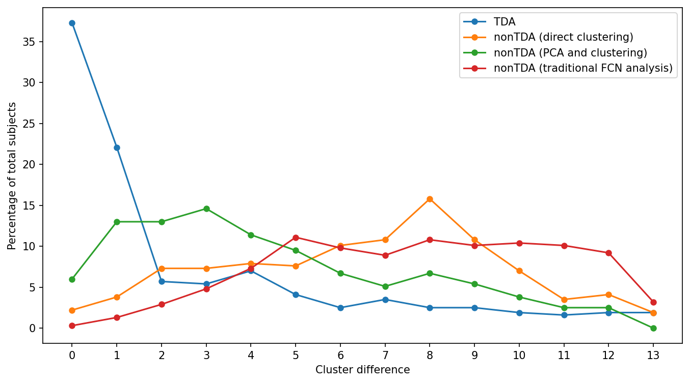
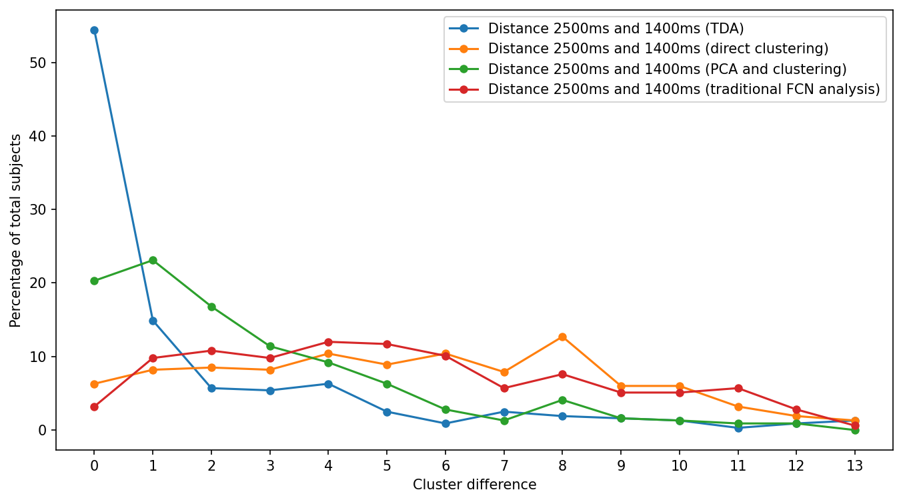
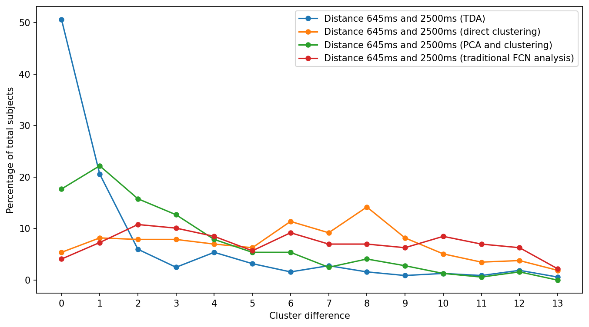

# Topology assisted clustering of temporal fMRI

## Pipelines
- TDA pipeline:

- (nonTDA) Direct time-series clustering pipeline:

- (nonTDA) PCA-based dimensionality reduction and clustering pipeline:

- (nonTDA) Traditional functional connectivity network analysis pipeline:


### Dataset
- Data dimensions:
  - DFC 2500: 316 x 86 x 113 x 113,
  - DFC 1400: 316 x 336 x 113 x 113
  - DFC 645: 316 x 754 x 113 x 113 
- Normalize data should be in three folders:
```shell
../dfc_645_normal
../dfc_1400_normal
../dfc_2500_normal
```
- Sample name for normalize data: `normalize_dfc_2500_subject_1_time_1.txt`
- Generated distance matrix folders for TDA pipeline:
```shell
../dfc_645_subjects_distance_matrix_ws
../dfc_1400_subjects_distance_matrix_ws
../dfc_2500_subjects_distance_matrix_ws
```
- Generated distance matrix folders for nonTDA pipeline:
```shell
../dfc_645_non_tda_subjects_distance_matrix_eu
../dfc_1400_non_tda_subjects_distance_matrix_eu
../dfc_2500_non_tda_subjects_distance_matrix_eu
```
- Generated mds folders:
```shell
../dfc_645_subjects_mds_ws
../dfc_1400_subjects_mds_ws
../dfc_2500_subjects_mds_ws
```
- Generated cluster folders:
```shell
../clusters_kmeans_ws
../clusters_kmeans_non_tda
```

## Run Instructions
### Set up environment
- Create, activate, and install required packages using Python 3:
```shell
python3 -m venv venv
source venv/bin/activate
pip install -r requirements.txt
```

```
# Distance calculation
python distance_calculation.py --data 645 --method ws --start 1 --end 316 --distance y --mds y
python distance_calculation.py --data 1400 --method ws --start 1 --end 316 --distance y --mds y
python distance_calculation.py --data 2500 --method ws --start 1 --end 316 --distance y --mds y
python non_tda_distance_calculation.py --data 2500 --method eu --start 1 --end 316 --distance y --mds y
python non_tda_distance_calculation.py --data 1400 --method eu --start 1 --end 316 --distance y --mds y
python non_tda_distance_calculation.py --data 645 --method eu --start 1 --end 316 --distance y --mds y
python cluster_calculation.py
python cluster_calculation_direct_clustering.py
python cluster_calculation_pca.py
python cluster_calculation_nontda.py
python statistical_calculation.py -d output/clusters_kmeans/clusters.json
python statistical_calculation.py -d output/clusters_kmeans_non_tda/clusters.json
```

## Results

- TDA pipeline and nonTDA pipelines cohort wide cluster distance comparison (less distance is better):


- TDA pipeline and nonTDA pipelines pairwise cluster distance comparison (less distance is better):





- Clustering result for a single subject (subject 8) using TDA and nonTDA pipelines:


### Cohort wide cluster distance comparison

- TDA (Wasserstein distance):
``` 
Clustering Method: KMeans
Best cluster selection using Silhouette Score in 2-15 range
Total subjects: 316
Match percentages:
Distance:   0, number of subjects: 118, percentage: 37.34%
Distance:   1, number of subjects:  70, percentage: 22.15%
Distance:   2, number of subjects:  18, percentage: 5.70%
Distance:   3, number of subjects:  17, percentage: 5.38%
Distance:   4, number of subjects:  22, percentage: 6.96%
Distance:   5, number of subjects:  13, percentage: 4.11%
Distance:   6, number of subjects:   8, percentage: 2.53%
Distance:   7, number of subjects:  11, percentage: 3.48%
Distance:   8, number of subjects:   8, percentage: 2.53%
Distance:   9, number of subjects:   8, percentage: 2.53%
Distance:  10, number of subjects:   6, percentage: 1.90%
Distance:  11, number of subjects:   5, percentage: 1.58%
Distance:  12, number of subjects:   6, percentage: 1.90%
Distance:  13, number of subjects:   6, percentage: 1.90%
```
- nonTDA direct clustering:
```shell
Clustering Method: KMeans
Best cluster selection using Silhouette Score in 2-15 range
Total subjects: 316
Match percentages:
Distance:   0, number of subjects:   7, percentage: 2.22%
Distance:   1, number of subjects:  12, percentage: 3.80%
Distance:   2, number of subjects:  23, percentage: 7.28%
Distance:   3, number of subjects:  23, percentage: 7.28%
Distance:   4, number of subjects:  25, percentage: 7.91%
Distance:   5, number of subjects:  24, percentage: 7.59%
Distance:   6, number of subjects:  32, percentage: 10.13%
Distance:   7, number of subjects:  34, percentage: 10.76%
Distance:   8, number of subjects:  50, percentage: 15.82%
Distance:   9, number of subjects:  34, percentage: 10.76%
Distance:  10, number of subjects:  22, percentage: 6.96%
Distance:  11, number of subjects:  11, percentage: 3.48%
Distance:  12, number of subjects:  13, percentage: 4.11%
Distance:  13, number of subjects:   6, percentage: 1.90%
Method main((), {}) executed in 0.0094 seconds
```
- nonTDA PCA and clustering:
```shell
Clustering Method: KMeans
Best cluster selection using Silhouette Score in 2-15 range
Total subjects: 316
Match percentages:
Distance:   0, number of subjects:  19, percentage: 6.01%
Distance:   1, number of subjects:  41, percentage: 12.97%
Distance:   2, number of subjects:  41, percentage: 12.97%
Distance:   3, number of subjects:  46, percentage: 14.56%
Distance:   4, number of subjects:  36, percentage: 11.39%
Distance:   5, number of subjects:  30, percentage: 9.49%
Distance:   6, number of subjects:  21, percentage: 6.65%
Distance:   7, number of subjects:  16, percentage: 5.06%
Distance:   8, number of subjects:  21, percentage: 6.65%
Distance:   9, number of subjects:  17, percentage: 5.38%
Distance:  10, number of subjects:  12, percentage: 3.80%
Distance:  11, number of subjects:   8, percentage: 2.53%
Distance:  12, number of subjects:   8, percentage: 2.53%
```

- nonTDA traditional FCN analysis (Euclidean distance):
```
Clustering Method: KMeans
Best cluster selection using Silhouette Score in 2-15 range
Total subjects: 316
Match percentages:
Distance:   0, number of subjects:   1, percentage: 0.32%
Distance:   1, number of subjects:   4, percentage: 1.27%
Distance:   2, number of subjects:   9, percentage: 2.85%
Distance:   3, number of subjects:  15, percentage: 4.75%
Distance:   4, number of subjects:  23, percentage: 7.28%
Distance:   5, number of subjects:  35, percentage: 11.08%
Distance:   6, number of subjects:  31, percentage: 9.81%
Distance:   7, number of subjects:  28, percentage: 8.86%
Distance:   8, number of subjects:  34, percentage: 10.76%
Distance:   9, number of subjects:  32, percentage: 10.13%
Distance:  10, number of subjects:  33, percentage: 10.44%
Distance:  11, number of subjects:  32, percentage: 10.13%
Distance:  12, number of subjects:  29, percentage: 9.18%
Distance:  13, number of subjects:  10, percentage: 3.16%
```

### Pairwise cluster distance comparison
- Pairwise analysis for TDA pipeline:
```
Similarity between DFC2500 and DFC1400
Distance:   0, number of subjects: 172, percentage: 54.43%
Distance:   1, number of subjects:  47, percentage: 14.87%
Distance:   2, number of subjects:  18, percentage: 5.70%
Distance:   3, number of subjects:  17, percentage: 5.38%
Distance:   4, number of subjects:  20, percentage: 6.33%
Distance:   5, number of subjects:   8, percentage: 2.53%
Distance:   6, number of subjects:   3, percentage: 0.95%
Distance:   7, number of subjects:   8, percentage: 2.53%
Distance:   8, number of subjects:   6, percentage: 1.90%
Distance:   9, number of subjects:   5, percentage: 1.58%
Distance:  10, number of subjects:   4, percentage: 1.27%
Distance:  11, number of subjects:   1, percentage: 0.32%
Distance:  12, number of subjects:   3, percentage: 0.95%
Distance:  13, number of subjects:   4, percentage: 1.27%


Similarity between DFC1400 and DFC645
Distance:   0, number of subjects: 176, percentage: 55.70%
Distance:   1, number of subjects:  61, percentage: 19.30%
Distance:   2, number of subjects:  12, percentage: 3.80%
Distance:   3, number of subjects:  11, percentage: 3.48%
Distance:   4, number of subjects:   9, percentage: 2.85%
Distance:   5, number of subjects:   9, percentage: 2.85%
Distance:   6, number of subjects:   8, percentage: 2.53%
Distance:   7, number of subjects:   6, percentage: 1.90%
Distance:   8, number of subjects:   3, percentage: 0.95%
Distance:   9, number of subjects:   7, percentage: 2.22%
Distance:  10, number of subjects:   3, percentage: 0.95%
Distance:  11, number of subjects:   5, percentage: 1.58%
Distance:  12, number of subjects:   3, percentage: 0.95%
Distance:  13, number of subjects:   3, percentage: 0.95%


Similarity between DFC645 and DFC2500
Distance:   0, number of subjects: 160, percentage: 50.63%
Distance:   1, number of subjects:  65, percentage: 20.57%
Distance:   2, number of subjects:  19, percentage: 6.01%
Distance:   3, number of subjects:   8, percentage: 2.53%
Distance:   4, number of subjects:  17, percentage: 5.38%
Distance:   5, number of subjects:  10, percentage: 3.16%
Distance:   6, number of subjects:   5, percentage: 1.58%
Distance:   7, number of subjects:   9, percentage: 2.85%
Distance:   8, number of subjects:   5, percentage: 1.58%
Distance:   9, number of subjects:   3, percentage: 0.95%
Distance:  10, number of subjects:   4, percentage: 1.27%
Distance:  11, number of subjects:   3, percentage: 0.95%
Distance:  12, number of subjects:   6, percentage: 1.90%
Distance:  13, number of subjects:   2, percentage: 0.63%
```

- Pairwise analysis for nonTDA direct clustering pipeline:
```shell
Distance & $2500ms$ and $1400ms$ & $1400ms$ and $645ms$ & $645ms$ and $2500ms$ \\ \hline 
0 & 20 & 6.329\% & 104 & 32.911\% & 17 & 5.380\% \\ \hline 
1 & 26 & 8.228\% & 81 & 25.633\% & 26 & 8.228\% \\ \hline 
2 & 27 & 8.544\% & 53 & 16.772\% & 25 & 7.911\% \\ \hline 
3 & 26 & 8.228\% & 24 & 7.595\% & 25 & 7.911\% \\ \hline 
4 & 33 & 10.443\% & 23 & 7.278\% & 22 & 6.962\% \\ \hline 
5 & 28 & 8.861\% & 15 & 4.747\% & 20 & 6.329\% \\ \hline 
6 & 33 & 10.443\% & 3 & 0.949\% & 36 & 11.392\% \\ \hline 
7 & 25 & 7.911\% & 6 & 1.899\% & 29 & 9.177\% \\ \hline 
8 & 40 & 12.658\% & 6 & 1.899\% & 45 & 14.241\% \\ \hline 
9 & 19 & 6.013\% & 1 & 0.316\% & 26 & 8.228\% \\ \hline 
10 & 19 & 6.013\% & 0 & 0.000\% & 16 & 5.063\% \\ \hline 
11 & 10 & 3.165\% & 0 & 0.000\% & 11 & 3.481\% \\ \hline 
12 & 6 & 1.899\% & 0 & 0.000\% & 12 & 3.797\% \\ \hline 
13 & 4 & 1.266\% & 0 & 0.000\% & 6 & 1.899\% \\ \hline 
Method main((), {}) executed in 0.0007 seconds
```
- Pairwise analysis for nonTDA PCA pipeline:
```shell
Distance & $2500ms$ and $1400ms$ & $1400ms$ and $645ms$ & $645ms$ and $2500ms$ \\ \hline 
0 & 64 & 20.253\% & 70 & 22.152\% & 56 & 17.722\% \\ \hline 
1 & 73 & 23.101\% & 46 & 14.557\% & 70 & 22.152\% \\ \hline 
2 & 53 & 16.772\% & 43 & 13.608\% & 50 & 15.823\% \\ \hline 
3 & 36 & 11.392\% & 41 & 12.975\% & 40 & 12.658\% \\ \hline 
4 & 29 & 9.177\% & 23 & 7.278\% & 25 & 7.911\% \\ \hline 
5 & 20 & 6.329\% & 17 & 5.380\% & 17 & 5.380\% \\ \hline 
6 & 9 & 2.848\% & 15 & 4.747\% & 17 & 5.380\% \\ \hline 
7 & 4 & 1.266\% & 17 & 5.380\% & 8 & 2.532\% \\ \hline 
8 & 13 & 4.114\% & 14 & 4.430\% & 13 & 4.114\% \\ \hline 
9 & 5 & 1.582\% & 12 & 3.797\% & 9 & 2.848\% \\ \hline 
10 & 4 & 1.266\% & 8 & 2.532\% & 4 & 1.266\% \\ \hline 
11 & 3 & 0.949\% & 8 & 2.532\% & 2 & 0.633\% \\ \hline 
12 & 3 & 0.949\% & 2 & 0.633\% & 5 & 1.582\% \\ \hline 
```
- Pairwise analysis for nonTDA direct clustering pipeline:
```shell
Distance & $2500ms$ and $1400ms$ & $1400ms$ and $645ms$ & $645ms$ and $2500ms$ \\ \hline 
0 & 10 & 3.165\% & 39 & 12.342\% & 13 & 4.114\% \\ \hline 
1 & 31 & 9.810\% & 47 & 14.873\% & 23 & 7.278\% \\ \hline 
2 & 34 & 10.759\% & 41 & 12.975\% & 34 & 10.759\% \\ \hline 
3 & 31 & 9.810\% & 26 & 8.228\% & 32 & 10.127\% \\ \hline 
4 & 38 & 12.025\% & 35 & 11.076\% & 27 & 8.544\% \\ \hline 
5 & 37 & 11.709\% & 31 & 9.810\% & 18 & 5.696\% \\ \hline 
6 & 32 & 10.127\% & 24 & 7.595\% & 29 & 9.177\% \\ \hline 
7 & 18 & 5.696\% & 17 & 5.380\% & 22 & 6.962\% \\ \hline 
8 & 24 & 7.595\% & 25 & 7.911\% & 22 & 6.962\% \\ \hline 
9 & 16 & 5.063\% & 12 & 3.797\% & 20 & 6.329\% \\ \hline 
10 & 16 & 5.063\% & 7 & 2.215\% & 27 & 8.544\% \\ \hline 
11 & 18 & 5.696\% & 5 & 1.582\% & 22 & 6.962\% \\ \hline 
12 & 9 & 2.848\% & 4 & 1.266\% & 20 & 6.329\% \\ \hline 
13 & 2 & 0.633\% & 3 & 0.949\% & 7 & 2.215\% \\ \hline
```

### References
- [Rips complex docs](https://gudhi.inria.fr/python/latest/rips_complex_user.html)
- [Wasserstein docs](https://gudhi.inria.fr/python/3.3.0/wasserstein_distance_user.html)
- [Bottleneck docs](https://gudhi.inria.fr/python/latest/bottleneck_distance_user.html)
- [Cheaha slurm docs](https://docs.uabgrid.uab.edu/wiki/Slurm)
- [Squeue docs](https://www.mankier.com/1/squeue)
