### Commands
```shell
python -u distance_calculation_down_sampling.py --data 645 --method ws --start 1 --end 316 --distance y --mds y --down 4
=
```

- Clustering DFC 2500, DFC 645 (Down sample 4), DFC 645:
```shell
#clusters DFC 2500 == DFC 645 (Down sample 4): 166
#clusters DFC 645 == DFC 645 (Down sample 4): 293
```
```shell
cat clusteringresult_down_job.out 
Clustering Method: KMeans
Best cluster selection using Silhouette Score in 2-15 range
Total subjects: 316
Match percentages:
Distance:   0, number of subjects: 158, percentage: 50.00%
Distance:   1, number of subjects:  65, percentage: 20.57%
Distance:   2, number of subjects:  19, percentage: 6.01%
Distance:   3, number of subjects:   8, percentage: 2.53%
Distance:   4, number of subjects:  18, percentage: 5.70%
Distance:   5, number of subjects:  11, percentage: 3.48%
Distance:   6, number of subjects:   4, percentage: 1.27%
Distance:   7, number of subjects:   8, percentage: 2.53%
Distance:   8, number of subjects:   5, percentage: 1.58%
Distance:   9, number of subjects:   4, percentage: 1.27%
Distance:  10, number of subjects:   4, percentage: 1.27%
Distance:  11, number of subjects:   4, percentage: 1.27%
Distance:  12, number of subjects:   6, percentage: 1.90%
Distance:  13, number of subjects:   2, percentage: 0.63%
Method main((), {}) executed in 0.0207 seconds
```
- Clustering with Bottleneck distance:
```
Done. Generated clusters: subject 1 - 316

Clustering Method: KMeans
Best cluster selection using Silhouette Score in 2-15 range
Total subjects: 316
Match percentages:
Distance:   0, number of subjects:   5, percentage: 1.58%
Distance:   1, number of subjects:  33, percentage: 10.44%
Distance:   2, number of subjects:  36, percentage: 11.39%
Distance:   3, number of subjects:  28, percentage: 8.86%
Distance:   4, number of subjects:  21, percentage: 6.65%
Distance:   5, number of subjects:  29, percentage: 9.18%
Distance:   6, number of subjects:  26, percentage: 8.23%
Distance:   7, number of subjects:  25, percentage: 7.91%
Distance:   8, number of subjects:  18, percentage: 5.70%
Distance:   9, number of subjects:  21, percentage: 6.65%
Distance:  10, number of subjects:  20, percentage: 6.33%
Distance:  11, number of subjects:  22, percentage: 6.96%
Distance:  12, number of subjects:  16, percentage: 5.06%
Distance:  13, number of subjects:  16, percentage: 5.06%
```
- Distance with Bottleneck distance output for DFC 2500:
```
bn distance JSON created for Subject 316
Done generating the {distance_method} distance matrix JSON files
Method generate_distance_matrix(('../dfc_2500_normal', '../dfc_2500_subjects_distance_matrix_bn', 316, 86, 'normalize_dfc_2500_subject_', 1, 316), {'distance_method': 'bn'}) executed in 3660.6987 seconds


MDS JSON created for Subject 315
Method get_mds_matrix((316, '../dfc_2500_subjects_distance_matrix_bn'), {}) executed in 0.1224 seconds

MDS JSON created for Subject 316
Done generating the MDS JSON files
Method generate_mds(('../dfc_2500_subjects_mds_bn', '../dfc_2500_subjects_distance_matrix_bn', 316, 1, 316), {'distance_method': 'bn'}) executed in 40.3340 seconds

Method main((2500, 'bn'), {}) executed in 3701.0327 seconds
```
- Distance with Bottleneck distance output for DFC 1400:
```
bn distance JSON created for Subject 315
Generating distance matrix for Subject 316
Method get_distance_matrix(('../dfc_1400_normal', 316, 336, 'normalize_dfc_1400_subject_', 'bn'), {}) executed in 132.1008 seconds

bn distance JSON created for Subject 316
Done generating the {distance_method} distance matrix JSON files
Method generate_distance_matrix(('../dfc_1400_normal', '../dfc_1400_subjects_distance_matrix_bn', 316, 336, 'normalize_dfc_1400_subject_', 255, 316), {'distance_method': 'bn'}) executed in 8885.7671 seconds

MDS JSON created for Subject 315
Method get_mds_matrix((316, '../dfc_1400_subjects_distance_matrix_bn'), {}) executed in 0.9681 seconds

MDS JSON created for Subject 316
Done generating the MDS JSON files
Method generate_mds(('../dfc_1400_subjects_mds_bn', '../dfc_1400_subjects_distance_matrix_bn', 316, 1, 316), {'distance_method': 'bn'}) executed in 263.6866 seconds

Method main((1400, 'bn'), {'start_subject': 255, 'end_subject': 316}) executed in 9149.4538 seconds
```
### Results using new formula
- Clustering with Wasserstein distance (NEW CORRELATION FORMULA):
```shell
Clustering Method: KMeans
Best cluster selection using Silhouette Score in 2-15 range
Total subjects: 316
Match percentages:
Distance:   0, number of subjects:  62, percentage: 19.62%
Distance:   1, number of subjects:  47, percentage: 14.87%
Distance:   2, number of subjects:  25, percentage: 7.91%
Distance:   3, number of subjects:  22, percentage: 6.96%
Distance:   4, number of subjects:  18, percentage: 5.70%
Distance:   5, number of subjects:  13, percentage: 4.11%
Distance:   6, number of subjects:  12, percentage: 3.80%
Distance:   7, number of subjects:  23, percentage: 7.28%
Distance:   8, number of subjects:  11, percentage: 3.48%
Distance:   9, number of subjects:  11, percentage: 3.48%
Distance:  10, number of subjects:  16, percentage: 5.06%
Distance:  11, number of subjects:  16, percentage: 5.06%
Distance:  12, number of subjects:  13, percentage: 4.11%
Distance:  13, number of subjects:  27, percentage: 8.54%
```

- Clustering with Bottleneck distance (NEW CORRELATION FORMULA):
```shell
Clustering Method: KMeans
Best cluster selection using Silhouette Score in 2-15 range
Total subjects: 316
Match percentages:
Distance:   0, number of subjects: 109, percentage: 34.49%
Distance:   1, number of subjects:  50, percentage: 15.82%
Distance:   2, number of subjects:  39, percentage: 12.34%
Distance:   3, number of subjects:  26, percentage: 8.23%
Distance:   4, number of subjects:  27, percentage: 8.54%
Distance:   5, number of subjects:  11, percentage: 3.48%
Distance:   6, number of subjects:  11, percentage: 3.48%
Distance:   7, number of subjects:   5, percentage: 1.58%
Distance:   8, number of subjects:   6, percentage: 1.90%
Distance:   9, number of subjects:   5, percentage: 1.58%
Distance:  10, number of subjects:   5, percentage: 1.58%
Distance:  11, number of subjects:   6, percentage: 1.90%
Distance:  12, number of subjects:   8, percentage: 2.53%
Distance:  13, number of subjects:   8, percentage: 2.53%
```

- Clustering with Euclidean distance (NEW CORRELATION FORMULA NONTDA):
```shell
Clustering Method: KMeans
Best cluster selection using Silhouette Score in 2-15 range
Total subjects: 316
Match percentages:
Distance:   0, number of subjects:   4, percentage: 1.27%
Distance:   1, number of subjects:   5, percentage: 1.58%
Distance:   2, number of subjects:  11, percentage: 3.48%
Distance:   3, number of subjects:  18, percentage: 5.70%
Distance:   4, number of subjects:  22, percentage: 6.96%
Distance:   5, number of subjects:  30, percentage: 9.49%
Distance:   6, number of subjects:  20, percentage: 6.33%
Distance:   7, number of subjects:  23, percentage: 7.28%
Distance:   8, number of subjects:  39, percentage: 12.34%
Distance:   9, number of subjects:  34, percentage: 10.76%
Distance:  10, number of subjects:  36, percentage: 11.39%
Distance:  11, number of subjects:  43, percentage: 13.61%
Distance:  12, number of subjects:  21, percentage: 6.65%
Distance:  13, number of subjects:  10, percentage: 3.16%
```

### TDA with Wasserstein distance where DFC 645 is down sampled

- Clustering result for subject 1 DFC 645 down sampled by 4:
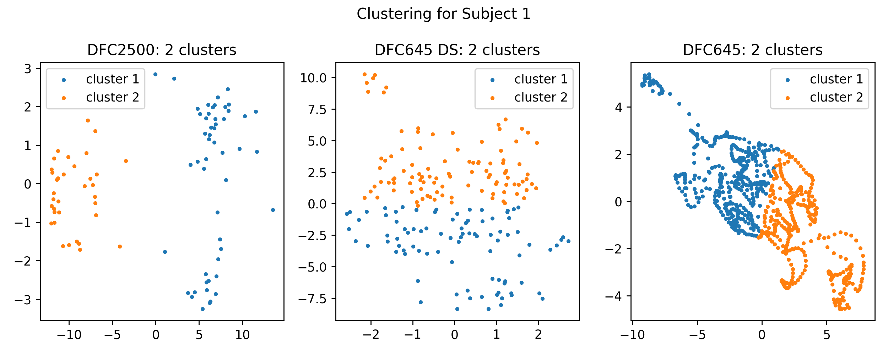

- Clustering result for subject 2 DFC 645 down sampled by 4:
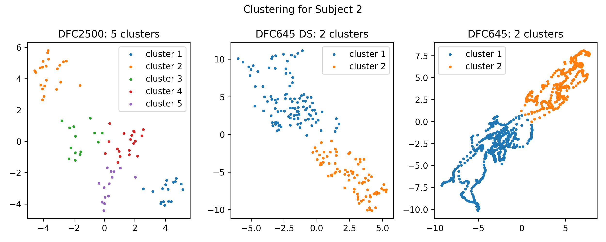

- Clustering result for subject 3 DFC 645 down sampled by 4:
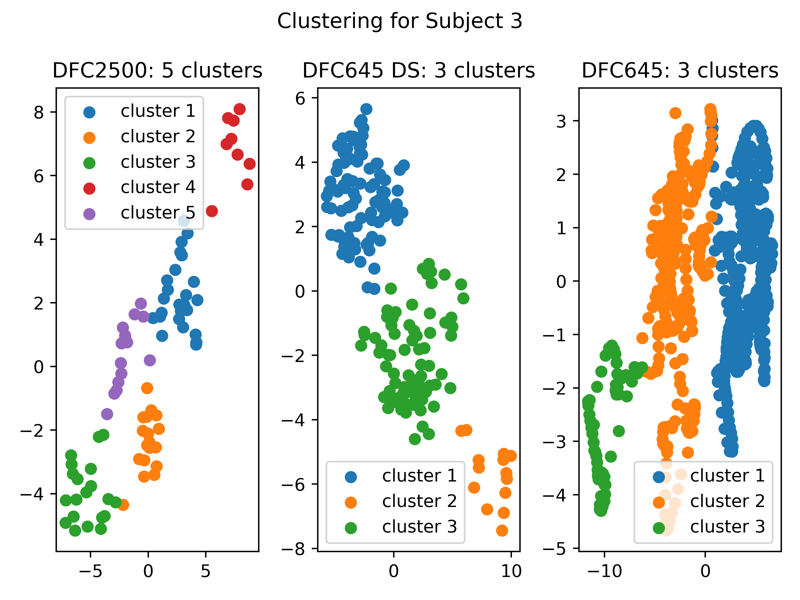


- Clustering result between all three cohorts for TDA, downsampled TDA, and nonTDA:

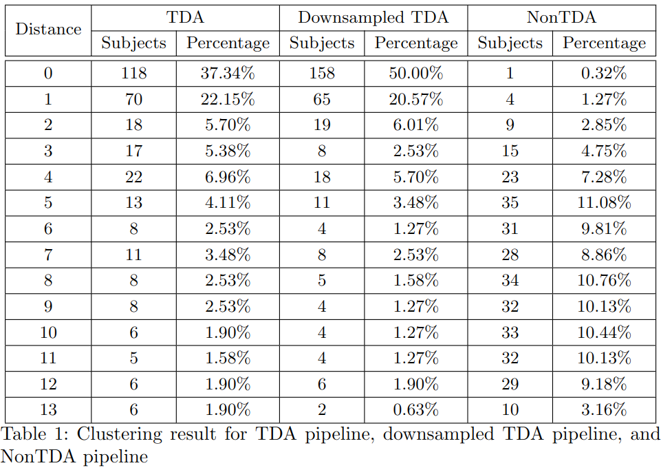


### TDA with Wasserstein distance

- Clustering result for subject 1 for TDA pipeline using Wasserstein metrics:
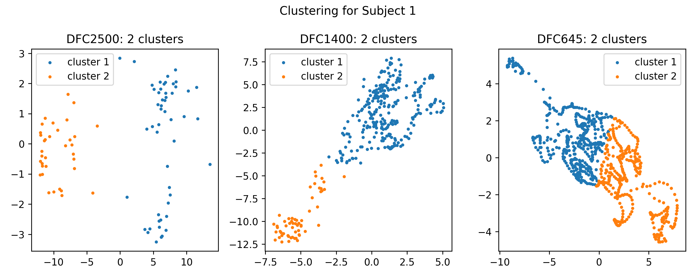

- Clustering result for subject 2 for TDA pipeline using Wasserstein metrics:
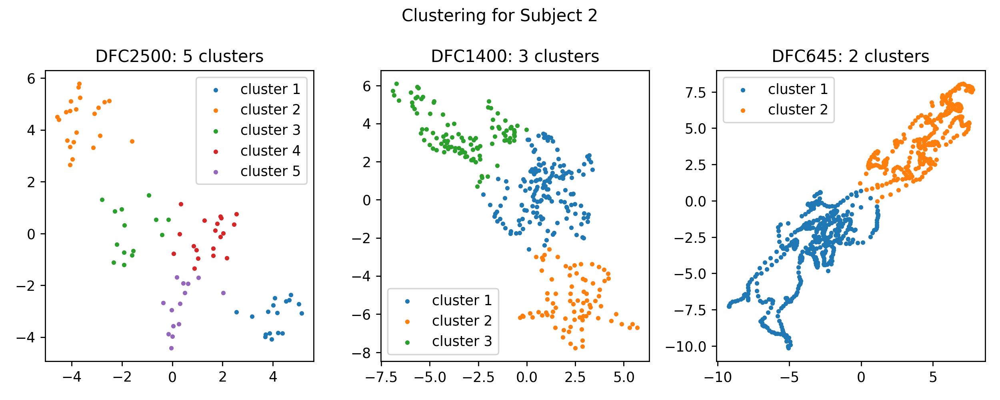

- Clustering result for subject 3 for TDA pipeline using Wasserstein metrics:
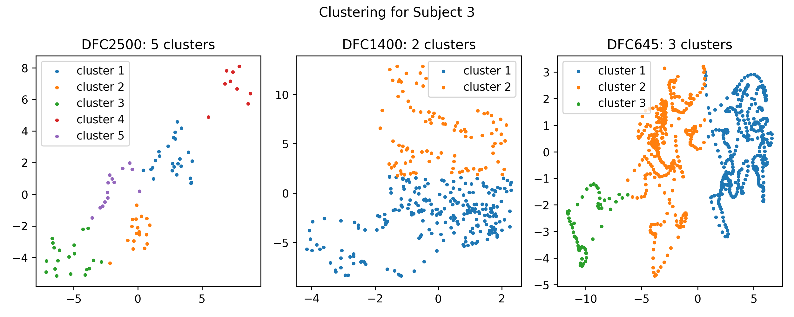


### nonTDA clustering

- Clustering result for subject 1 for nonTDA pipeline:


- Clustering result for subject 2 for nonTDA pipeline:


- Clustering result for subject 3 for nonTDA pipeline:


- Clustering result for TDA pipeline:

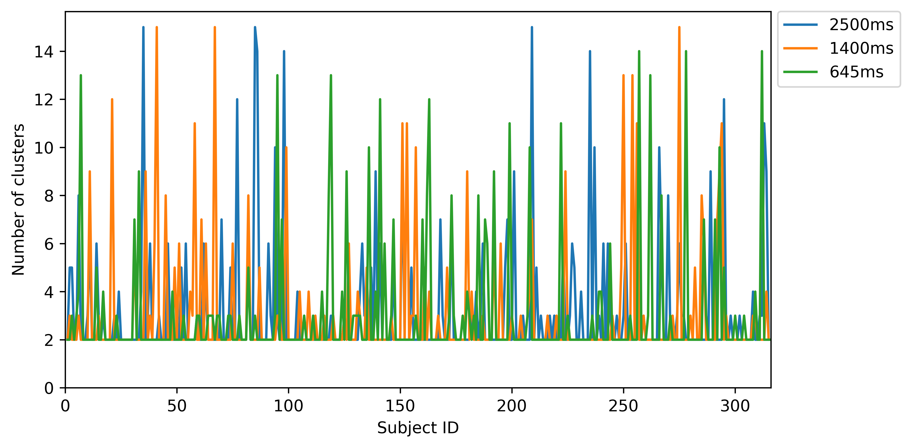

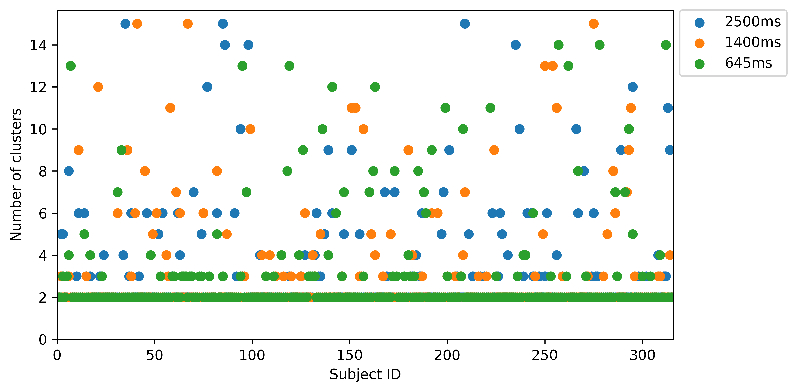

- Clustering result for NonTDA pipeline:

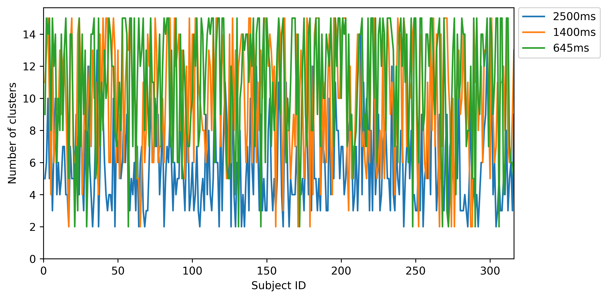

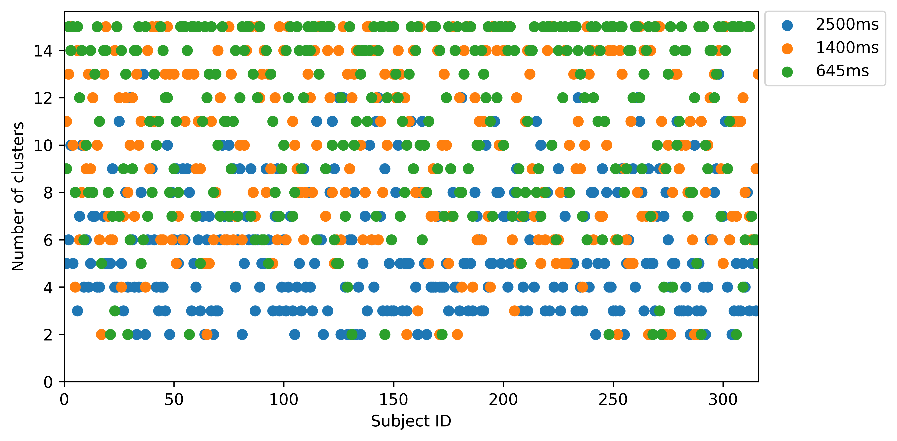

### Result summary

- Pairwise clustering result for TDA pipeline:

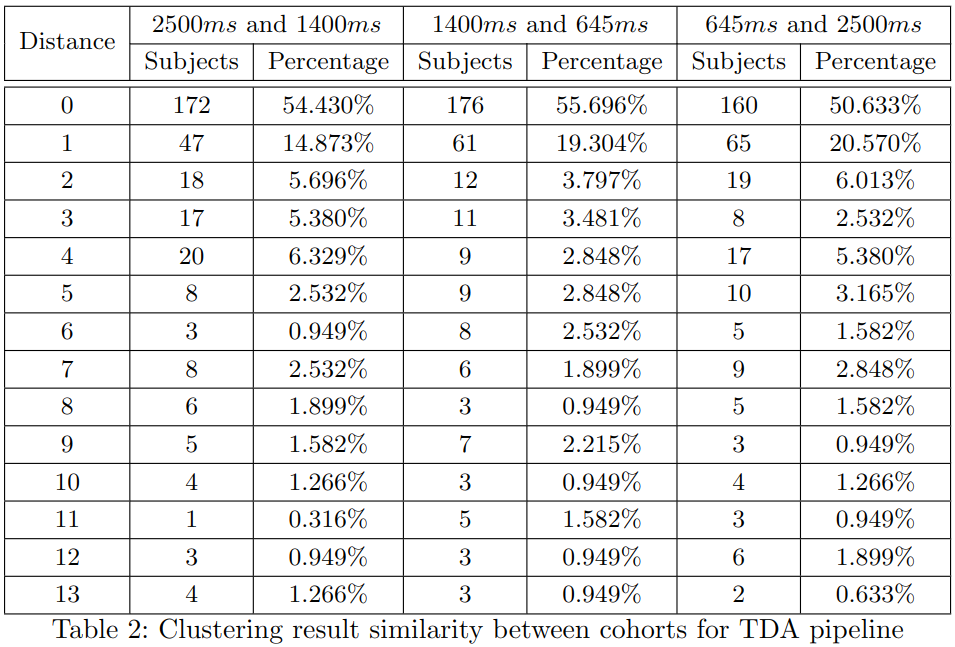

- Pairwise clustering result for Downsampled TDA pipeline:

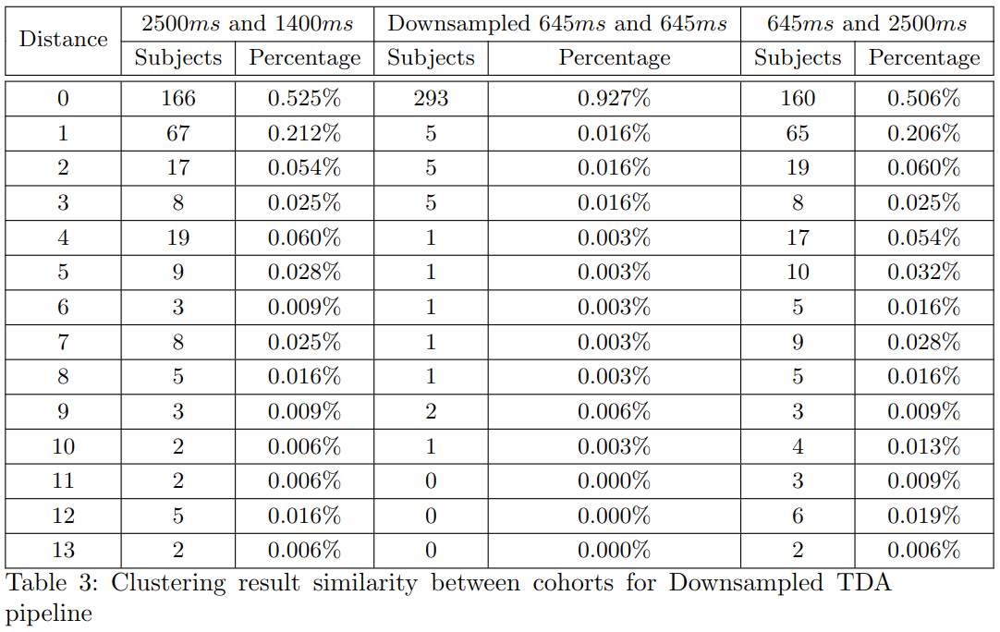

- Pairwise clustering result for nonTDA pipeline:

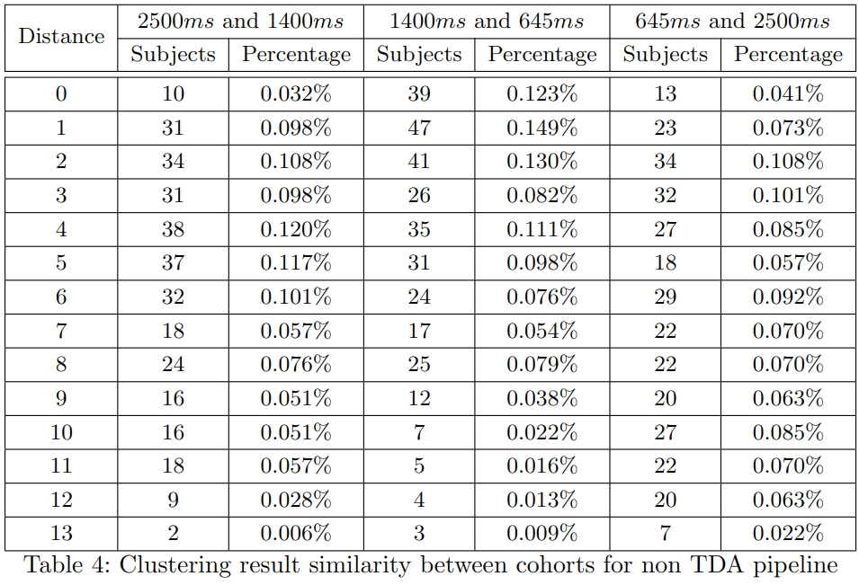


### Number of files
```shell
[ashovon@login004 matfiles]$ pwd
/home/ashovon/newaumri/matfiles
[ashovon@login004 matfiles]$ ls dfc_2500_normal | wc -l
27176
[ashovon@login004 matfiles]$ ls dfc_1400_normal | wc -l
106176
[ashovon@login004 matfiles]$ ls dfc_645_normal | wc -l
238264
[ashovon@login004 matfiles]$ du -sh dfc_2500_normal
6.7G	dfc_2500_normal
[ashovon@login004 matfiles]$ du -sh dfc_1400_normal
26G	dfc_1400_normal
[ashovon@login004 matfiles]$ du -sh dfc_645_normal
59G	dfc_645_normal

```
